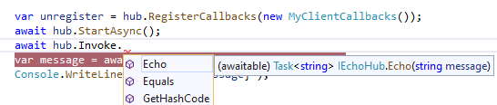
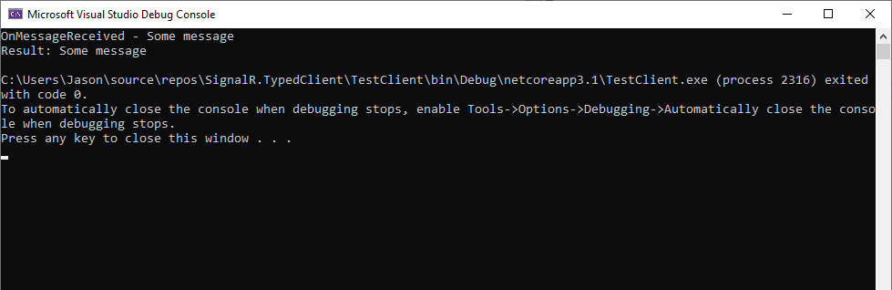

# SignalR.TypedClient
A proof of concept for strongly typed SignalR Clients using `Castle.DynamicProxy`

**Note:** This does not currently respect `Hub` attributes.



## Client Code

```csharp
using Microsoft.AspNetCore.SignalR.Client;
using System;
using System.Threading.Tasks;
using SignalR.TypedClient;
using TestCommon;

namespace TestClient
{
    class Program
    {
        static async Task Main(string[] args)
        {
            var builder = new HubConnectionBuilder();
            await Task.Delay(TimeSpan.FromSeconds(3));
            var hub = builder
                .WithUrl("http://localhost:5000/echo")
                .WithAutomaticReconnect()
                // New extension method
                .Build<IEchoHub>();

            // Register a strongly typed class to capture callbacks
            var unregister = hub.RegisterCallbacks(new MyClientCallbacks());
            
            // Connect
            await hub.StartAsync();
            
            // Invoke methods via an interface
            var message = await hub.Invoke.Echo("Some message");
            Console.WriteLine($"Result: {message}");
        }
    }

    public class MyClientCallbacks : IEchoHubClient
    {
        public Task OnMessageReceived(string message)
        {
            Console.WriteLine($"{nameof(OnMessageReceived)} - {message}");
            return Task.CompletedTask;
        }
    }
}
```

## Server Code
```csharp
using Microsoft.AspNetCore.SignalR;
using System.Threading.Tasks;
using TestCommon;

namespace TestServer
{
    public class EchoHub : Hub<IEchoHubClient>, IEchoHub
    {
        public async Task<string> Echo(string message)
        {
            await Clients.All.OnMessageReceived(message);
            return message;
        }
    }
}
```

**Output:**

